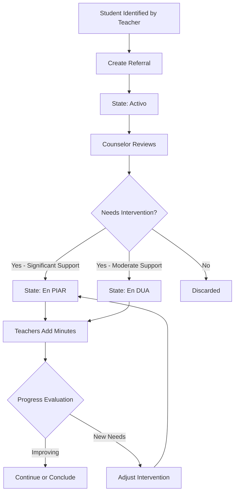

The Academic Tracking feature provides comprehensive oversight of student interventions, state transitions, and progress through psycho-orientation processes. This feature is used by all roles to monitor students requiring special attention.

## Overview

Academic tracking allows the platform to maintain complete records of:
- Student state transitions (Activo → PIAR → DUA)
- Referral history and multiple referrals for the same student
- Psychological report timeline
- Teacher observations and intervention strategies
- Progress documentation through minutes (actas)

<Note>
  The platform maintains a complete audit trail for each student, enabling data-driven decisions about intervention effectiveness.
</Note>

## Student States

Students progress through different states based on their needs and interventions:

### State Definitions

<Steps>
  <Step title="Activo (Active - Pending Review)">
    **Description**: Student has been referred by a teacher and is awaiting psycho-orientation counselor review.
    
    **Who Can View**:
    - The referring teacher
    - The assigned counselor (based on student's grade)
    
    **Next Actions**:
    - Counselor reviews referral details
    - Counselor creates psychological report
    - Counselor changes state to PIAR, DUA, or discards referral
  </Step>

  <Step title="En PIAR (In PIAR Process)">
    **Description**: Student is receiving a Plan Individual de Ajustes Razonables (Individual Plan of Reasonable Adjustments).
    
    **Who Can View**:
    - All teachers assigned to student's groups
    - The assigned counselor
    
    **Next Actions**:
    - Teachers add progress minutes
    - Counselor monitors intervention effectiveness
    - May transition to different state based on progress
  </Step>

  <Step title="En DUA (In DUA Process)">
    **Description**: Student is receiving Diseño Universal para el Aprendizaje (Universal Design for Learning) accommodations.
    
    **Who Can View**:
    - All teachers assigned to student's groups
    - The assigned counselor
    
    **Next Actions**:
    - Teachers add progress minutes
    - Counselor monitors intervention effectiveness
    - May continue or conclude intervention
  </Step>
</Steps>

### State Transition Flow



## Filtering Students by State

Different roles have access to filtered views based on student states.

### Teacher Views

<Accordion title="My Referred Students (Activo)">
  Teachers can view students they have referred who are still in "activo" status (pending counselor review).
  
  ```php
  // CreateReferralController.php:130-157
  public function index_student_remitted(Request $request)
  {
      $id_teacher = Auth::id();

      // Get students in 'activo' state sent by this teacher
      $query = Users_student::whereHas('states', function ($q) {
          $q->whereIn('state', ['activo']);
      })->where('sent_by', $id_teacher);

      $students = $query->with('latestReferral', 'group', 'degree')
          ->orderBy('name', 'asc')
          ->orderBy('last_name', 'asc')
          ->paginate(15);

      return view('teacher.studentListRemitted', compact('students'));
  }
  ```
  
  **Use Case**: Track which referrals are still pending counselor action.
</Accordion>

<Accordion title="Students in PIAR/DUA (My Groups)">
  Teachers can view students in PIAR or DUA processes who are in groups they teach.
  
  ```php
  // CreateReferralController.php:222-250
  public function addMinutes(Request $request)
  {
      $id_teacher = Auth::id();
      $id_load_groups = Users_load_group::where('id_user_teacher', $id_teacher)
                                        ->pluck('id_group');

      // Get students in 'en PIAR' or 'en DUA' states in teacher's groups
      $query = Users_student::whereHas('states', function ($q) {
          $q->whereIn('state', ['en PIAR', 'en DUA']);
      })->whereIn('id_group', $id_load_groups);

      $students = $query->orderBy('name', 'asc')
          ->orderBy('last_name', 'asc')
          ->paginate(15);

      return view('teacher.addMinutes', compact('students'));
  }
  ```
  
  **Use Case**: Add progress minutes for students undergoing interventions in your classes.
</Accordion>

### Counselor Views

<Accordion title="Pending Referrals (Activo)">
  Counselors see all students in "activo" status within their assigned grades.
  
  ```php
  // PsicoController.php:105-133
  public function index_student_remitted_psico(Request $request)
  {
      $id_psico = Auth::id();

      $load_degree = Users_load_degree::where('id_user', $id_psico)
          ->pluck('id_degree')
          ->toArray();

      $query = Users_student::whereHas('states', function ($q) {
              $q->where('state', 'activo');
          })
          ->whereIn('id_degree', $load_degree);

      $students = $query
          ->orderBy('name')
          ->orderBy('last_name')
          ->paginate(15);

      return view('psycho.listRemitted', compact('students'));
  }
  ```
  
  **Use Case**: Review new referrals and create psychological reports.
</Accordion>

<Accordion title="All Active Students">
  View all students in assigned grades, regardless of state.
  
  ```php
  // PsicoController.php:63-93
  public function index_students_active_psico(Request $request)
  {
      $id_psico = Auth::id();

      $load_degree = Users_load_degree::where('id_user', $id_psico)
          ->pluck('id_degree')
          ->toArray();

      $query = Users_student::whereIn('id_degree', $load_degree);
      
      // No state filter - shows all students
  }
  ```
  
  **Use Case**: Get overview of all students under your supervision.
</Accordion>

<Accordion title="Students in PIAR">
  Filter to show only students currently in PIAR interventions.
  
  ```php
  // PsicoController.php:95-98
  public function index_students_piar_psico(Request $request)
  {
      return $this->studentsByState($request, 'en PIAR', 'En PIAR', 'psico.students.piar');
  }
  ```
  
  **Use Case**: Monitor students receiving intensive support.
</Accordion>

<Accordion title="Students in DUA">
  Filter to show only students currently in DUA interventions.
  
  ```php
  // PsicoController.php:100-103
  public function index_students_dua_psico(Request $request)
  {
      return $this->studentsByState($request, 'en DUA', 'En DUA', 'psico.students.dua');
  }
  ```
  
  **Use Case**: Track students with universal learning design accommodations.
</Accordion>

## Referral History Tracking

The platform tracks multiple referrals for the same student over time.

### Latest Referral Relationship

The student model includes a relationship to easily access the most recent referral:

```php
// Users_student.php:76-79
public function latestReferral()
{
    return $this->hasOne(Referral::class, 'id_user_student')->latestOfMany();
}
```

### All Referrals Relationship

```php
// Users_student.php:64-67
public function referrals()
{
    return $this->hasMany(Referral::class, 'id_user_student');
}
```

### Viewing Complete Referral History

Counselors can view all referrals submitted for a student:

```php
// PsicoController.php:301-318
public function show_student_history(string $id)
{
    $student = Users_student::findOrFail($id);

    $referrals = Referral::where('id_user_student', $id)
        ->orderBy('created_at', 'desc')
        ->paginate(10);

    $reports = Psychoorientation::where('id_user_student', $id)
        ->orderBy('created_at', 'desc')
        ->paginate(10);

    return view('psycho.studentHistory', compact(
        'student',
        'referrals',
        'reports'
    ));
}
```

<CardGroup cols={2}>
  <Card title="Chronological Order" icon="clock">
    Referrals are displayed from newest to oldest, showing patterns over time.
  </Card>
  <Card title="Paginated Results" icon="list">
    History is paginated (10 per page) for students with extensive records.
  </Card>
</CardGroup>

## Psychological Reports Timeline

Each psychological report is stored with complete metadata and can be tracked over time.

### Report Fields Tracked

| Field | Purpose |
|-------|--------|
| psychologist_writes | Which counselor created the report |
| id_user_student | Link to student record |
| age_student | Student's age at time of report |
| group_student | Student's group/section at time of report |
| director_group_student | Group director at time of report |
| title_report | Report title/summary |
| reason_inquiry | Why psychological evaluation was conducted |
| recomendations | Intervention recommendations |
| annex_one | Path to uploaded supporting document |
| created_at | When the report was created |
| updated_at | Last modification timestamp |

### Viewing Report Timeline

Reports are displayed in chronological order within the student history view:

```php
// From show_student_history in PsicoController.php:309-311
$reports = Psychoorientation::where('id_user_student', $id)
    ->orderBy('created_at', 'desc')
    ->paginate(10);
```

## Data Relationships

The academic tracking system leverages Laravel's Eloquent relationships for efficient data access.

### Student Model Relationships

```php
// Users_student.php

// Relationship with referring teacher
public function teacher()
{
    return $this->belongsTo(Users_teacher::class, 'sent_by');
}

// Relationship with academic degree
public function degree()
{
    return $this->belongsTo(Degree::class, 'id_degree');
}

// Relationship with group
public function group()
{
    return $this->belongsTo(Group::class, 'id_group');
}

// Relationship with state
public function states()
{
    return $this->belongsTo(State::class, 'id_state');
}

// All referrals for this student
public function referrals()
{
    return $this->hasMany(Referral::class, 'id_user_student');
}

// Most recent referral
public function latestReferral()
{
    return $this->hasOne(Referral::class, 'id_user_student')->latestOfMany();
}
```

### Referral Model Relationships

```php
// Referral.php:25-27
public function user_student() {
    return $this->belongsTo(Users_student::class, 'id_user_student');
}

// Referral.php:30-32
public function user_teacher() {
    return $this->belongsTo(Users_teacher::class, 'id_user_teacher');
}
```

### Psychoorientation Model Relationships

```php
// Psychoorientation.php:30-33
public function user_psychology()
{
    return $this->belongsTo(Users_teacher::class, 'psychologist_writes');
}

// Psychoorientation.php:38-41
public function user_student()
{
    return $this->belongsTo(Users_student::class, 'id_user_student');
}
```

## Search and Filtering

All student list views include comprehensive search capabilities.

### Search Fields

Users can search by:
- Student first name
- Student last name
- Full name (concatenated first + last)
- Document number

### Implementation Pattern

```php
// Common pattern across controllers
if ($request->filled('search')) {
    $searchTerm = $request->input('search');
    
    $query->where(function ($q) use ($searchTerm) {
        $q->where('name', 'LIKE', "%{$searchTerm}%")
          ->orWhere('last_name', 'LIKE', "%{$searchTerm}%")
          ->orWhere('number_documment', 'LIKE', "%{$searchTerm}%")
          ->orWhereRaw("CONCAT(name, ' ', last_name) LIKE ?", ["%{$searchTerm}%"]);
    });
}
```

<Note>
  Search is case-insensitive and uses SQL LIKE patterns for flexible matching.
</Note>

## Pagination Strategy

All list views use consistent pagination:
- **Items per page**: 15
- **Preserves filters**: Query string parameters maintained across pages
- **Ordered results**: Alphabetically by first name, then last name

```php
// Common pagination pattern
$students = $query->with('latestReferral', 'group', 'degree')
    ->orderBy('name', 'asc')
    ->orderBy('last_name', 'asc')
    ->paginate(15)
    ->withQueryString();
```

## Eager Loading for Performance

To prevent N+1 query problems, the platform uses eager loading:

```php
// Loading student with related data
$students = $query->with([
    'latestReferral',  // Most recent referral
    'group',            // Group information
    'degree',           // Grade/degree information
    'states',           // Current state
])->paginate(15);
```

## Data Integrity

The platform maintains data integrity through several mechanisms:

### State Validation

<CardGroup cols={2}>
  <Card title="Prevent Duplicate Referrals" icon="shield-check">
    System checks if student already exists in activo, PIAR, or DUA states before allowing new referral.
  </Card>
  <Card title="Grade-Counselor Verification" icon="user-shield">
    Validates that a counselor is assigned to the student's grade before accepting referral.
  </Card>
</CardGroup>

### Database Transactions

Critical operations use database transactions:

```php
// From store_referral in CreateReferralController.php:90-126
DB::beginTransaction();

try {
    // Create student
    $user = new Users_student();
    // ... set properties ...
    $user->save();

    // Create referral
    $referral = new Referral();
    // ... set properties ...
    $referral->save();

    // Send notification
    Mail::to($psico_date->email)->queue(new CreatedReferralMail($user, $referral));

    DB::commit();

    return redirect()->back()->with('success', 'Estudiante remitido exitosamente.');
} catch (\Exception $e) {
    DB::rollback();
    return redirect()->back()->with('error', 'Hubo problemas en el proceso, intentelo nuevamente.');
}
```

## Reporting Capabilities

The academic tracking system provides data for various reporting needs:

### Available Metrics

<AccordionGroup>
  <Accordion title="Referral Volume">
    - Total referrals per teacher
    - Referrals per grade
    - Referrals per time period
    - Trends over academic year
  </Accordion>
  
  <Accordion title="Intervention Distribution">
    - Students in PIAR vs DUA
    - Distribution by grade
    - Duration of interventions
  </Accordion>
  
  <Accordion title="Counselor Workload">
    - Active cases per counselor
    - Reports created per counselor
    - Grade coverage
  </Accordion>
</AccordionGroup>

## Related Features

<CardGroup cols={3}>
  <Card title="Student Referrals" icon="file-medical" href="/features/student-referrals">
    Create and manage referrals that feed into tracking system
  </Card>
  <Card title="Psycho-Orientation" icon="brain" href="/features/psycho-orientation">
    Process referrals and change student states
  </Card>
  <Card title="User Management" icon="users" href="/features/user-management">
    Configure teacher-group and counselor-grade assignments for proper routing
  </Card>
</CardGroup>
