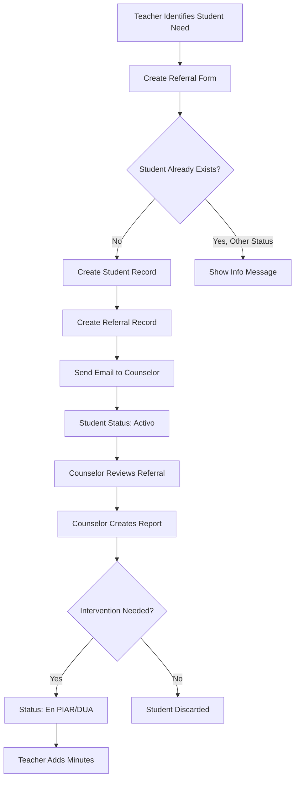

The Student Referral system allows teachers to formally refer students who need psychological or behavioral support to the psycho-orientation counselor assigned to their grade level. This creates a documented workflow for student intervention.

## Overview

When a teacher identifies a student requiring psycho-orientation support, they submit a referral that includes:
- Student demographic information
- Reason for the referral
- Observations about the student's behavior or academic performance
- Strategies already attempted by the teacher

<Note>
  Referrals are automatically routed to the counselor assigned to the student's grade. The counselor receives an email notification when a new referral is created.
</Note>

## Creating a Student Referral

<Steps>
  <Step title="Access Referral Form">
    Navigate to **Student Referral** from the teacher dashboard. The form displays available grades and groups.
    
    ```php
    // CreateReferralController.php:22-29
    public function create_referral()
    {
        $groups = Group::orderByRaw('CAST(`group` AS UNSIGNED), `group`')->get();
        $degrees = Degree::orderByRaw('CAST(`degree` AS UNSIGNED), `degree`')->get();

        return view('teacher.studentReferral', compact('groups', 'degrees'));
    }
    ```
  </Step>

  <Step title="Enter Student Information">
    Provide the student's basic information:
    
    **Required Fields:**
    - **Document Number**: 1-20 digits, must be unique
    - **Name**: Student's first name(s)
    - **Last Name**: Student's surname(s)
    - **Grade**: Academic grade/level
    - **Group**: Class section
    
    **Optional Fields:**
    - **Age**: Student's age (validated as minimum 0)
  </Step>

  <Step title="Document the Referral">
    Complete the referral documentation with detailed information:
    
    ### Reason for Referral
    Explain why the student is being referred to psycho-orientation. Be specific about concerns or behaviors observed.
    
    ### Observations
    Provide detailed observations about the student's academic performance, behavior, social interactions, or any other relevant factors.
    
    ### Strategies Attempted
    List the interventions and strategies you've already tried with this student. This helps the counselor understand what has been attempted.
    
    <Warning>
      All three documentation fields (reason, observations, strategies) are required. Incomplete referrals will not be accepted.
    </Warning>
  </Step>

  <Step title="Submit Referral">
    Click **Submit** to create the referral. The system will:
    
    1. Validate that a counselor is assigned to the selected grade
    2. Check if the student is already in the system
    3. Create a new student record with role "estudiante"
    4. Set student status to "activo" (pending review)
    5. Create the referral record
    6. Send email notification to the assigned counselor
    
    ```php
    // CreateReferralController.php:52-61
    $degreeLoad = Users_load_degree::where('id_degree', $request->input('degree'))->first();

    if (!$degreeLoad) {
        return redirect()->back()->with('error', 'No se encontró un psicoorientador asignado para el grado seleccionado, comunicate con cordinación académica para que asigne a un psicoorientador.');
    }

    $id_psico = $degreeLoad->id_user;
    $psico_date = Users_teacher::where('id', $id_psico)->first();
    ```
  </Step>
</Steps>

## Student Status Validation

The referral system includes intelligent checks to prevent duplicate or conflicting referrals.

### Status Checks

When submitting a referral, the system verifies if the student already exists:

<Accordion title="Student in 'Activo' Status">
  **Message**: "El estudiante ya fue remitido y está en revisión por el psicoorientador."
  
  The student has already been referred and is awaiting review by the counselor. A new referral cannot be created until the current one is resolved.
</Accordion>

<Accordion title="Student in 'En PIAR' Status">
  **Message**: "El estudiante ya está en proceso PIAR."
  
  The student is currently in a PIAR (Plan Individual de Ajustes Razonables) process. New referrals are not permitted during this intervention.
</Accordion>

<Accordion title="Student in 'En DUA' Status">
  **Message**: "El estudiante ya está en proceso DUA."
  
  The student is currently in a DUA (Diseño Universal para el Aprendizaje) process. The existing intervention must conclude before new referrals can be submitted.
</Accordion>

```php
// CreateReferralController.php:63-88
if ($exist_student) {
    $current_state = $exist_student->id_state;
    $state_info = State::where('id', $current_state)->firstOrFail();

    if ($state_info->state === 'activo') {
        return redirect()->back()->with(
            'info',
            'El estudiante ya fue remitido y está en revisión por el psicoorientador.'
        );
    } elseif ($state_info->state === 'en PIAR') {
        return redirect()->back()->with(
            'info',
            'El estudiante ya está en proceso PIAR.'
        );
    } elseif ($state_info->state === 'en DUA') {
        return redirect()->back()->with(
            'info',
            'El estudiante ya está en proceso DUA.'
        );
    }
}
```

## Referral Data Storage

Referrals are stored using a transaction to ensure data consistency:

```php
// CreateReferralController.php:90-126
DB::beginTransaction();

try {
    // Create student record
    $user = new Users_student();
    $user->number_documment = $request->number_documment;
    $user->name = $request->name;
    $user->last_name = $request->last_name;
    $user->age = $request->age;
    $user->id_degree = $request->degree;
    $user->id_group = $request->group;
    $user->sent_by = $id_teacher;
    $user->id_state = $state->id;
    $user->assignRole('estudiante');
    $user->save();

    // Create referral record
    $referral = new Referral();
    $referral->id_user_student = $user->id;
    $referral->id_user_teacher = $id_teacher;
    $referral->reason = $request->reason_referral;
    $referral->observation = $request->observation;
    $referral->strategies = $request->strategies;
    $referral->course = $degreeName;
    $referral->save();

    // Send email notification
    Mail::to($psico_date->email)->queue(new CreatedReferralMail($user, $referral));

    DB::commit();

    return redirect()->back()->with('success', 'Estudiante remitido exitosamente.');
} catch (\Exception $e) {
    DB::rollback();
    return redirect()->back()->with('error', 'Hubo problemas en el proceso, intentelo nuevamente.');
}
```

## Viewing Your Referrals

Teachers can view all students they have referred who are in "activo" status (pending counselor review).

### Referral List Features

<CardGroup cols={2}>
  <Card title="Search Functionality" icon="magnifying-glass">
    Search by student name, last name, document number, or full name to quickly find specific referrals.
  </Card>
  <Card title="Pagination" icon="table">
    Results are displayed 15 per page with automatic pagination for large datasets.
  </Card>
</CardGroup>

```php
// CreateReferralController.php:130-158
public function index_student_remitted(Request $request)
{
    $id_teacher = Auth::id();

    // Get students in 'activo' state sent by this teacher
    $query = Users_student::whereHas('states', function ($q) {
        $q->whereIn('state', ['activo']);
    })->where('sent_by', $id_teacher);

    // Search filter
    if ($request->filled('search')) {
        $searchTerm = $request->input('search');
        $query->where(function ($q) use ($searchTerm) {
            $q->where('name', 'LIKE', '%' . $searchTerm . '%')
                ->orWhere('last_name', 'LIKE', '%' . $searchTerm . '%')
                ->orWhere('number_documment', 'LIKE', '%' . $searchTerm . '%')
                ->orWhereRaw("CONCAT(name, ' ', last_name) LIKE ?", ['%' . $searchTerm . '%']);
        });
    }

    $students = $query->with('latestReferral', 'group', 'degree')
        ->orderBy('name', 'asc')
        ->orderBy('last_name', 'asc')
        ->paginate(15);

    return view('teacher.studentListRemitted', compact('students'));
}
```

## Editing Student Information

Before the counselor processes a referral, teachers can update student information if needed.

<Steps>
  <Step title="Select Student to Edit">
    From your referral list, click the edit icon next to the student.
  </Step>

  <Step title="Modify Student Data">
    Update any of the following:
    - Document number (must remain unique)
    - Name and last name
    - Grade and group
    - Age
    
    <Note>
      You cannot edit the referral reason, observations, or strategies from this form. These fields are part of the referral record, not the student record.
    </Note>
  </Step>

  <Step title="Save Changes">
    The system validates the new counselor assignment for the updated grade:
    
    ```php
    // CreateReferralController.php:204-209
    $degreeLoad = Users_load_degree::where('id_degree', $request->input('degree'))->first();

    if (!$degreeLoad) {
        return redirect()->back()->with('error', 'No se encontró un psicoorientador asignado para el grado seleccionado...');
    }
    ```
  </Step>
</Steps>

## Email Notifications

When a referral is created, an automated email is sent to the assigned counselor containing:
- Student name and document number
- Grade and group information
- Referring teacher's name
- Referral reason and observations
- Timestamp of referral creation

```php
// CreateReferralController.php:117
Mail::to($psico_date->email)->queue(new CreatedReferralMail($user, $referral));
```

<Note>
  Emails are queued for asynchronous delivery to prevent blocking the referral submission process.
</Note>

## Adding Minutes for PIAR/DUA Students

Teachers can add progress minutes (actas) for students in PIAR or DUA processes within their assigned groups.

### Accessing Add Minutes

```php
// CreateReferralController.php:222-250
public function addMinutes(Request $request)
{
    $id_teacher = Auth::id();
    $id_load_groups = Users_load_group::where('id_user_teacher', $id_teacher)
                                      ->pluck('id_group');

    // Get students in 'en PIAR' or 'en DUA' states in teacher's groups
    $query = Users_student::whereHas('states', function ($q) {
        $q->whereIn('state', ['en PIAR', 'en DUA']);
    })->whereIn('id_group', $id_load_groups);

    // Search and pagination...
    
    return view('teacher.addMinutes', compact('students'));
}
```

<CardGroup cols={2}>
  <Card title="Filtered View" icon="filter">
    Only shows students in PIAR or DUA processes who are in groups assigned to you.
  </Card>
  <Card title="Progress Documentation" icon="file-lines">
    Document progress, challenges, and next steps for students under intervention.
  </Card>
</CardGroup>

## Referral Workflow Summary



## Validation Rules

| Field | Validation | Error Message |
|-------|-----------|---------------|
| Document Number | Required, 1-20 digits, unique | "El número de documento ya se encuentra registrado o no tiene la longitud requerida" |
| Name | Required, string | Required field |
| Last Name | Required, string | Required field |
| Grade | Required, exists in degrees table | Required selection |
| Group | Required, exists in groups table | Required selection |
| Age | Optional, integer, minimum 0 | Must be non-negative |
| Reason for Referral | Required, string | Required field |
| Observation | Required, string | Required field |
| Strategies | Required, string | Required field |

## Related Features

<CardGroup cols={3}>
  <Card title="User Management" icon="users" href="/features/user-management">
    Coordinators assign counselors to grades, enabling referral routing
  </Card>
  <Card title="Psycho-Orientation" icon="clipboard-medical" href="/features/psycho-orientation">
    Counselors review and process referrals in their assigned grades
  </Card>
  <Card title="Academic Tracking" icon="chart-line" href="/features/academic-tracking">
    Track student progress through PIAR and DUA interventions
  </Card>
</CardGroup>
