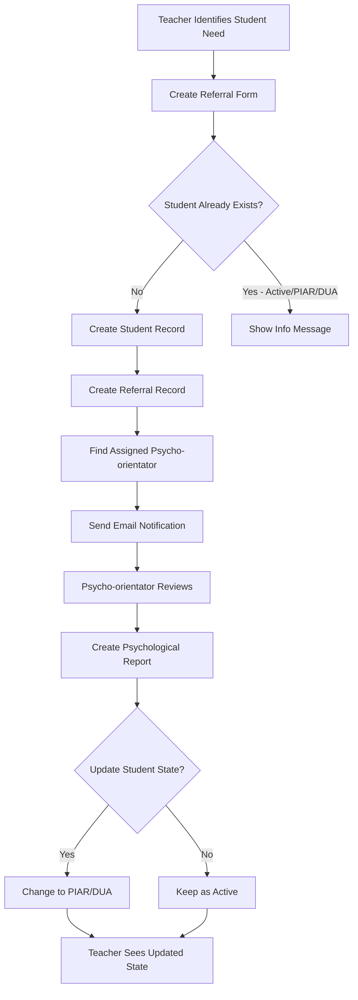

## What is Bethlemitas?

Bethlemitas is a specialized Laravel-based SaaS platform designed to streamline the management of student psycho-orientation services in educational institutions. The platform provides a comprehensive workflow for identifying students who need psychological support, creating referrals, tracking interventions, and maintaining detailed historical records.

Built on **Laravel 11** with **PHP 8.2**, Bethlemitas integrates role-based access control (via Spatie Permissions), academic tracking, and multi-state student management to create a complete solution for educational psycho-orientation departments.

<Note>
**Target Audience**: Educational institutions that provide psycho-orientation services, including coordinators, teachers (docentes), and psycho-orientators (psicoorientadores).
</Note>

## Who Uses Bethlemitas?

The platform serves three primary user roles, each with specific responsibilities and access permissions:

<CardGroup cols={3}>
  <Card title="Coordinators" icon="user-shield" href="/roles/coordinator">
    Administrative control over users, groups, degrees, and academic areas
  </Card>
  <Card title="Teachers (Docentes)" icon="chalkboard-user" href="/roles/teacher">
    Create student referrals and monitor students under their care
  </Card>
  <Card title="Psycho-Orientators" icon="user-doctor" href="/roles/psycho-orientator">
    Review referrals, create reports, and manage student interventions
  </Card>
</CardGroup>

### Role Breakdown

<AccordionGroup>
  <Accordion title="Coordinators" icon="user-shield">
    Coordinators have full administrative access to:
    - Create and manage user accounts (teachers and psycho-orientators)
    - Configure academic structures (degrees, groups, areas)
    - Assign teachers to specific groups and subject areas
    - Assign psycho-orientators to grade levels
    
    **Access Level**: Full system administration via `RoleMiddleware` (routes/web.php:91)
  </Accordion>

  <Accordion title="Teachers (Docentes)" icon="chalkboard-user">
    Teachers are responsible for:
    - Creating student referrals when psycho-orientation support is needed
    - Viewing and managing students they have referred
    - Updating student information and referral details
    - Adding minutes/notes for students in PIAR or DUA programs
    
    **Access Level**: Referral creation and student monitoring via `RoleDocenteMiddleware` (routes/web.php:122)
  </Accordion>

  <Accordion title="Psycho-Orientators (Psicoorientadores)" icon="user-doctor">
    Psycho-orientators handle:
    - Reviewing incoming referrals from teachers
    - Creating detailed psychological orientation reports
    - Managing student state transitions (Active → PIAR → DUA)
    - Maintaining comprehensive student history records
    - Uploading supporting documentation (PDFs)
    
    **Access Level**: Report creation and student state management via `RolePsicoorientadorMiddleware` (routes/web.php:158)
  </Accordion>
</AccordionGroup>

## Key Features

### Student Referral System

The referral workflow is the core of Bethlemitas, enabling teachers to flag students who need psycho-orientation support:

<Steps>
  <Step title="Teacher Creates Referral">
    Teachers complete a referral form with student information, reason for referral, observations, and intervention strategies already attempted (`CreateReferralController::store_referral`, app/Http/Controllers/CreateReferralController.php:32)
  </Step>
  <Step title="Automatic Assignment">
    The system automatically assigns the referral to the appropriate psycho-orientator based on the student's grade level via `Users_load_degree` relationship
  </Step>
  <Step title="Email Notification">
    Psycho-orientator receives an email notification (`CreatedReferralMail`) about the new referral
  </Step>
  <Step title="Review and Report">
    Psycho-orientator reviews the referral and creates a detailed psychological report with recommendations
  </Step>
</Steps>

**Key Implementation Details**:
- Referrals are stored in the `referrals` table with fields: `reason`, `observation`, `strategies`, `course`
- Students are created in `users_students` table with initial state "activo"
- Teachers cannot submit duplicate referrals for students already in active states

### Student State Management

Bethlemitas tracks students through multiple intervention states:

<CardGroup cols={3}>
  <Card title="Active (Activo)" icon="circle-check">
    Student has been referred and is under initial review by psycho-orientator
  </Card>
  <Card title="PIAR" icon="clipboard-list">
    Student requires an Individualized Educational Adjustment Plan (Plan Individual de Ajustes Razonables)
  </Card>
  <Card title="DUA" icon="universal-access">
    Student follows Universal Learning Design (Diseño Universal para el Aprendizaje) principles
  </Card>
</CardGroup>

State transitions are managed by psycho-orientators through the report creation workflow (`PsicoController::store_report_student`, app/Http/Controllers/PsicoController.php:215).

### Psycho-Orientation Reports

Comprehensive psychological reports include:

- **Title and Context**: Report title and reason for inquiry
- **Student Information**: Age, group, class director
- **Recommendations**: Detailed intervention recommendations
- **Supporting Documents**: PDF attachments stored in `storage/app/public/annexes/`
- **Audit Trail**: Timestamp and psychologist identification

Reports are stored in the `psychoorientations` table and linked to students via `id_user_student` foreign key (app/Models/Psychoorientation.php:1).

### Academic Structure

The platform supports flexible academic organization:

- **Institutions**: Multi-institution support (though typically single institution per deployment)
- **Degrees**: Grade levels (e.g., "6", "7", "8", "9", "10", "11")
- **Groups**: Class groups within each degree (e.g., "A", "B", "C")
- **Areas**: Subject areas (e.g., Mathematics, Science, Language Arts)

Teachers are assigned to specific combinations of areas and groups via the `teachers_areas_groups` pivot table (app/Models/Users_teacher.php:77).

## Technical Architecture

### Technology Stack

<CardGroup cols={2}>
  <Card title="Backend Framework" icon="laravel">
    **Laravel 11** with PHP 8.2+ for robust MVC architecture
  </Card>
  <Card title="Authentication" icon="lock">
    Laravel's built-in authentication with custom `Users_teacher` model
  </Card>
  <Card title="Authorization" icon="shield-check">
    **Spatie Laravel-Permission 6.3** for role-based access control
  </Card>
  <Card title="Database" icon="database">
    MySQL/MariaDB with comprehensive foreign key relationships
  </Card>
</CardGroup>

### Key Models

The application uses Eloquent ORM with the following primary models:

<Tabs>
  <Tab title="Users">
    - **Users_teacher**: Authenticatable model for staff (coordinators, teachers, psycho-orientators)
    - **Users_student**: Student records with referral history
    
    ```php
    // app/Models/Users_teacher.php
    protected $fillable = [
        'name', 'lastname', 'email', 'password',
        'document', 'phone', 'id_state', 'group_director'
    ];
    ```
  </Tab>
  
  <Tab title="Academic">
    - **Degree**: Grade levels with ordering support
    - **Group**: Class groups within degrees
    - **Area**: Subject areas taught by teachers
    - **Institution**: Educational institution information
    
    ```php
    // Relationships enable queries like:
    $teacher->groups()->with('degrees')->get();
    ```
  </Tab>
  
  <Tab title="Psycho-Orientation">
    - **Referral**: Teacher-submitted referrals linked to students
    - **Psychoorientation**: Psychologist reports with recommendations
    - **State**: Student intervention states (Active, PIAR, DUA)
    
    ```php
    // app/Models/Referral.php
    protected $fillable = [
        'id_user_student', 'id_user_teacher',
        'reason', 'observation', 'strategies', 'course'
    ];
    ```
  </Tab>
</Tabs>

### Security Features

<CardGroup cols={2}>
  <Card title="Role-Based Middleware" icon="shield-halved">
    Custom middleware classes enforce role-specific access: `RoleMiddleware`, `RoleDocenteMiddleware`, `RolePsicoorientadorMiddleware`
  </Card>
  <Card title="Account State Management" icon="circle-pause">
    Only active users (`id_state = 1`) can authenticate. Suspended accounts are blocked at login (app/Http/Controllers/auth/AuthController.php:35)
  </Card>
  <Card title="Password Recovery" icon="key">
    Laravel's built-in password reset functionality with email-based token verification (routes/web.php:37-53)
  </Card>
  <Card title="Session Management" icon="clock-rotate-left">
    `PreventBackHistoryMiddleware` prevents browser back button access to protected pages after logout
  </Card>
</CardGroup>

## Data Flow Example

Here's how a typical student referral flows through the system:



## Use Cases

<AccordionGroup>
  <Accordion title="Teacher Refers Student for Psychological Support" icon="hand-holding-heart">
    **Scenario**: A teacher notices a student struggling with behavioral issues.
    
    **Workflow**:
    1. Teacher logs in and navigates to "Create Referral" (`/create/referral`)
    2. Completes form with student details, reason, observations, and strategies attempted
    3. System validates student doesn't have active referral
    4. Student record is created with state "activo"
    5. Referral is assigned to psycho-orientator for the student's grade level
    6. Email notification sent automatically
    
    **Code Reference**: `CreateReferralController::store_referral` (app/Http/Controllers/CreateReferralController.php:32)
  </Accordion>

  <Accordion title="Psycho-Orientator Creates Intervention Plan" icon="clipboard-medical">
    **Scenario**: Psycho-orientator reviews referral and determines student needs PIAR intervention.
    
    **Workflow**:
    1. Psycho-orientator views pending referrals (`/index/students/remitted/psico`)
    2. Opens referral details to review teacher's observations
    3. Creates psychological report with title, inquiry reason, recommendations
    4. Updates student state from "activo" to "en PIAR"
    5. Optionally uploads supporting PDF documentation
    6. Report saved and student appears in PIAR student list
    
    **Code Reference**: `PsicoController::store_report_student` (app/Http/Controllers/PsicoController.php:215)
  </Accordion>

  <Accordion title="Coordinator Manages Academic Structure" icon="sitemap">
    **Scenario**: Coordinator needs to set up new academic year structure.
    
    **Workflow**:
    1. Coordinator creates/updates degrees (grade levels)
    2. Creates groups for each degree (e.g., 6A, 6B, 7A, 7B)
    3. Creates or updates subject areas
    4. Creates teacher accounts and assigns roles
    5. Assigns teachers to specific area-group combinations
    6. Assigns psycho-orientators to grade levels via `Users_load_degree`
    
    **Code Reference**: Multiple controllers under coordinator middleware (routes/web.php:91-114)
  </Accordion>
</AccordionGroup>

## Why Bethlemitas?

<CardGroup cols={2}>
  <Card title="Centralized Management" icon="building">
    All student psycho-orientation data in one secure, accessible platform
  </Card>
  <Card title="Automated Workflows" icon="arrows-rotate">
    Automatic assignment, email notifications, and state tracking reduce manual coordination
  </Card>
  <Card title="Historical Tracking" icon="clock-rotate-left">
    Complete audit trail of referrals, reports, and interventions for each student
  </Card>
  <Card title="Role-Based Security" icon="user-lock">
    Granular permissions ensure users only access appropriate functionality
  </Card>
  <Card title="Compliance Ready" icon="file-contract">
    Structured data and documentation support educational compliance requirements
  </Card>
  <Card title="Scalable Architecture" icon="arrow-up-right-dots">
    Laravel framework enables easy extension and customization for institutional needs
  </Card>
</CardGroup>

## Next Steps

Ready to start using Bethlemitas? Follow our getting started guide:

<Card title="Getting Started" icon="rocket" href="/getting-started">
  Learn how to access your account, navigate the dashboard, and create your first referral
</Card>

Or explore specific features:

<CardGroup cols={2}>
  <Card title="User Management" icon="users-gear" href="/features/user-management">
    Coordinator guide to managing users and permissions
  </Card>
  <Card title="Student Referrals" icon="file-pen" href="/features/student-referrals">
    Detailed workflow for creating and managing referrals
  </Card>
  <Card title="Psycho-Orientation" icon="brain" href="/features/psycho-orientation">
    Creating reports and managing student interventions
  </Card>
  <Card title="Academic Tracking" icon="chart-line" href="/features/academic-tracking">
    Managing degrees, groups, and academic structures
  </Card>
</CardGroup>
