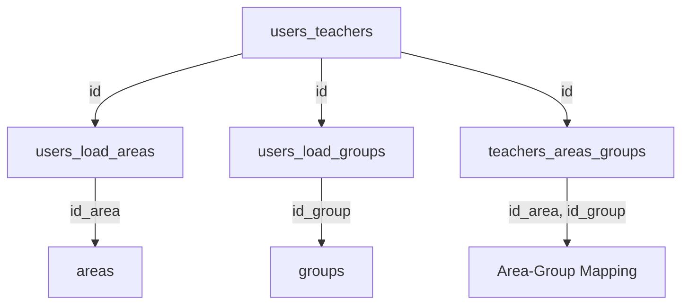
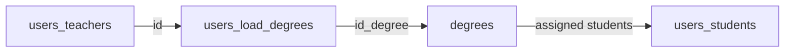

<Info>
The **Coordinator** role has the highest level of administrative access in the Bethlemitas platform, responsible for system configuration, user management, and institutional setup.
</Info>

## Overview

Coordinators are responsible for the complete administration of the educational platform. They manage users (teachers and psycho-orientators), configure academic structures (areas, degrees, groups), and ensure the system is properly configured for institutional needs.

### Role Implementation

The coordinator role is protected by the `RoleMiddleware` which validates access using Spatie's Laravel Permission package:

```php
public function handle(Request $request, Closure $next, ...$roles)
{
    if (!Auth::check() || !Auth::user()->hasRole('coordinador')) {
        abort(403, 'No tienes permiso para acceder a esta página.');
    }
    return $next($request);
}
```

*Source: `app/Http/Middleware/RoleMiddleware.php:12-20`*

## Key Responsibilities

<CardGroup cols={2}>
  <Card title="User Management" icon="users">
    Create, edit, and manage teachers and psycho-orientators
  </Card>
  <Card title="Academic Setup" icon="school">
    Configure degrees, groups, and subject areas
  </Card>
  <Card title="System Configuration" icon="gear">
    Institutional-level settings and permissions
  </Card>
  <Card title="Oversight" icon="eye">
    Monitor all system activities and user roles
  </Card>
</CardGroup>

## Permissions & Access

### User Management

Coordinators have exclusive access to create and manage staff accounts through the `CreateController`.

<Steps>
  <Step title="Create Users">
    Access the user creation form to add new teachers or psycho-orientators:
    
    ```php
    Route::get('/create/user', [CreateController::class, 'create_user'])
        ->name('create.user');
    ```
    
    *Route: `/create/user` (web.php:93)*
  </Step>

  <Step title="Configure Teacher Assignments">
    When creating a teacher, assign:
    - **Areas**: Subject areas the teacher will teach
    - **Groups**: Classes under their supervision
    - **Group Director**: Optional group leadership role
    - **Area-Group Mapping**: Specific areas taught in specific groups
    
    ```php
    $request->validate([
        'areas' => 'required|array',
        'areas.*' => 'exists:areas,id',
        'groups' => 'required|array',
        'groups.*' => 'exists:groups,id',
        'group_director' => 'nullable|unique:users_teachers',
        'area_id' => 'required|array',
        'groups_asig' => 'required|array',
    ]);
    ```
    
    *Source: `app/Http/Controllers/CreateController.php:135-149`*
  </Step>

  <Step title="Configure Psycho-Orientator Assignments">
    When creating a psycho-orientator, assign degree levels they will oversee:
    
    ```php
    $request->validate([
        'load_degree' => 'required|array',
        'load_degree.*' => 'exists:degrees,id',
    ]);
    ```
    
    Each degree can only be assigned to one psycho-orientator:
    
    ```php
    foreach ($request->load_degree as $degree) {
        $exists = Users_load_degree::where('id_degree', $degree)->exists();
        if ($exists) {
            return redirect()->back()->with('error', 
                'Existen grados que ya están asignados a otro/a psicoorientador/a.');
        }
    }
    ```
    
    *Source: `app/Http/Controllers/CreateController.php:260-274`*
  </Step>

  <Step title="List and Filter Users">
    View all teachers and psycho-orientators with filtering capabilities:
    
    ```php
    Route::get('/listing/users', [CreateController::class, 'index_users'])
        ->name('index.users');
    ```
    
    Supports:
    - Search by name, document, or area
    - Filter by user state (active/suspended)
    - Pagination (15 users per page)
    
    *Route: `/listing/users` (web.php:95)*
  </Step>

  <Step title="Edit User Details">
    Update user information and assignments:
    
    ```php
    Route::get('/edit/{id}/user', [CreateController::class, 'edit_user'])
        ->name('edit.user');
    Route::put('/update/user/{id}', [CreateController::class, 'update_user'])
        ->name('update.user');
    ```
    
    *Routes: `/edit/{id}/user` and `/update/user/{id}` (web.php:96-97)*
  </Step>

  <Step title="Suspend/Activate Users">
    Toggle user access without deleting accounts:
    
    ```php
    public function destroy_user($id)
    {
        $user = Users_teacher::findOrFail($id);
        if ($user->id_state == 1) {
            $user->id_state = 2; // Suspend
            $message = 'Usuario suspendido correctamente';
        } else {
            $user->id_state = 1; // Activate
            $message = 'Usuario activado correctamente';
        }
        $user->save();
    }
    ```
    
    *Source: `app/Http/Controllers/CreateController.php:650-667`*
  </Step>
</Steps>

### Academic Structure Management

Coordinators configure the institutional academic framework.

#### Groups Management

<CodeGroup>
```php CreateGroupController Routes
Route::get('/create/group', [CreateGroupController::class, 'create_group'])
    ->name('create.group');
Route::post('/store/group', [CreateGroupController::class, 'store_group'])
    ->name('store.group');
Route::put('/update/group', [CreateGroupController::class, 'update_group'])
    ->name('update.group');
Route::delete('/delete/group/{id}', [CreateGroupController::class, 'destroy_group'])
    ->name('destroy.group');
```
</CodeGroup>

*Routes: web.php:100-103*

#### Degrees Management

<CodeGroup>
```php CreateDegreeController Routes
Route::get('/create/degree', [CreateDegreeController::class, 'create_degree'])
    ->name('create.degree');
Route::post('/store/degree', [CreateDegreeController::class, 'store_degree'])
    ->name('store.degree');
Route::put('/update/degree', [CreateDegreeController::class, 'update_degree'])
    ->name('update.degree');
Route::delete('/delete/degree/{id}', [CreateDegreeController::class, 'destroy_degree'])
    ->name('delete.degree');
```
</CodeGroup>

*Routes: web.php:105-108*

#### Areas Management

<CodeGroup>
```php CreateAreaController Routes
Route::get('/create/area', [CreateAreaController::class, 'create_area'])
    ->name('create.area');
Route::post('/store/area', [CreateAreaController::class, 'store_area'])
    ->name('store.area');
Route::put('/update/area', [CreateAreaController::class, 'update_area'])
    ->name('update.area');
Route::delete('/delete/area/{id}', [CreateAreaController::class, 'destroy_area'])
    ->name('delete.area');
```
</CodeGroup>

*Routes: web.php:110-113*

## Typical Workflows

### Setting Up a New Teacher

<Steps>
  <Step title="Navigate to Create User">
    Access `/create/user` from the dashboard
  </Step>

  <Step title="Enter Basic Information">
    - Document number (used as default password)
    - Full name
    - Email address
  </Step>

  <Step title="Assign Role">
    Select "Docente" role from available options (excludes "estudiante" and "coordinador")
    
    ```php
    $roles = Role::whereNotIn('name', ['estudiante', 'coordinador'])->get();
    ```
    
    *Source: CreateController.php:28*
  </Step>

  <Step title="Configure Academic Assignments">
    - Select subject areas
    - Select groups (classes)
    - Optionally assign as group director
    - Map which areas are taught in which groups
  </Step>

  <Step title="Validation">
    The system validates:
    - No area conflicts (same area in same group by different teachers)
    - All assigned groups match the teacher's group list
    - Unique group director assignment
    
    ```php
    $exists = Teachers_areas_group::where('id_area', $area_id)
        ->where('id_group', $groupId)
        ->exists();
    if ($exists) {
        return redirect()->back()->with('error', 
            '¡Error! El area de ' . $name_area . 
            ' ya es impartida en el grupo ' . $name_group . 
            ' por otro docente');
    }
    ```
    
    *Source: CreateController.php:168-174*
  </Step>

  <Step title="Account Creation">
    User is created with:
    - Password: Same as document number (bcrypt encrypted)
    - State: Active
    - Role: Assigned via Spatie Permission
    
    ```php
    $user->password = bcrypt($request->input('number_documment'));
    $user->assignRole($role_name);
    $user->save();
    ```
    
    *Source: CreateController.php:188-190*
  </Step>
</Steps>

### Setting Up a New Psycho-Orientator

<Steps>
  <Step title="Access User Creation">
    Navigate to `/create/user`
  </Step>

  <Step title="Enter User Details">
    Document number, name, and email
  </Step>

  <Step title="Select Psicoorientador Role">
    Choose "Psicoorientador" from role dropdown
  </Step>

  <Step title="Assign Degree Levels">
    Select one or more degree levels (grades) for oversight
    
    <Warning>
    Each degree can only be assigned to **one** psycho-orientator. The system validates this:
    
    ```php
    foreach ($request->load_degree as $degree) {
        $exists = Users_load_degree::where('id_degree', $degree)->exists();
        if ($exists) {
            return redirect()->back()->with('error', 
                'Existen grados que ya están asignados a otro/a psicoorientador/a.');
        }
    }
    ```
    </Warning>
    
    *Source: CreateController.php:269-273*
  </Step>

  <Step title="Save Configuration">
    System creates the account and stores degree assignments in `users_load_degrees` table
  </Step>
</Steps>

## Data Relationships

### Teacher Configuration

When a coordinator creates a teacher, multiple database tables are populated:



**users_load_areas**: Stores which areas a teacher can teach  
**users_load_groups**: Stores which groups a teacher oversees  
**teachers_areas_groups**: Maps specific area assignments to specific groups

*Implementation: CreateController.php:192-221*

### Psycho-Orientator Configuration



**users_load_degrees**: Maps psycho-orientators to degree levels (one-to-one for each degree)

*Implementation: CreateController.php:287-293*

## Common Validations

<Warning>
**Area Assignment Conflict**

The system prevents multiple teachers from teaching the same area in the same group:

```php
$exists = Teachers_areas_group::where('id_area', $area_id)
    ->where('id_group', $groupId)
    ->exists();
if ($exists) {
    return redirect()->back()->with('error', 
        '¡Error! El area de ' . $name_area . 
        ' ya es impartida en el grupo ' . $name_group . 
        ' por otro docente');
}
```

*Source: CreateController.php:168-175*
</Warning>

<Warning>
**Degree Assignment Conflict**

Each degree level can only be assigned to one psycho-orientator:

```php
$exists = Users_load_degree::where('id_degree', $degree)->exists();
if ($exists) {
    return redirect()->back()->with('error', 
        'Existen grados que ya están asignados a otro/a psicoorientador/a.');
}
```

*Source: CreateController.php:243-246*
</Warning>

## Best Practices

<Note>
1. **Always assign degrees before creating referrals**: Ensure psycho-orientators are assigned to all active degree levels
2. **Avoid area conflicts**: Check existing assignments before modifying teacher schedules
3. **Use search and filters**: The user listing supports search to quickly find and manage users
4. **Suspend instead of delete**: Use the suspend feature to temporarily disable accounts while preserving data
5. **Document numbers as passwords**: Initial passwords match document numbers; advise users to change on first login
</Note>

## Related Documentation

<CardGroup cols={2}>
  <Card title="Teacher Role" icon="chalkboard-user" href="/roles/teacher">
    Learn about teacher capabilities and workflows
  </Card>
  <Card title="Psycho-Orientator Role" icon="user-doctor" href="/roles/psycho-orientator">
    Understand psycho-orientator responsibilities
  </Card>
</CardGroup>