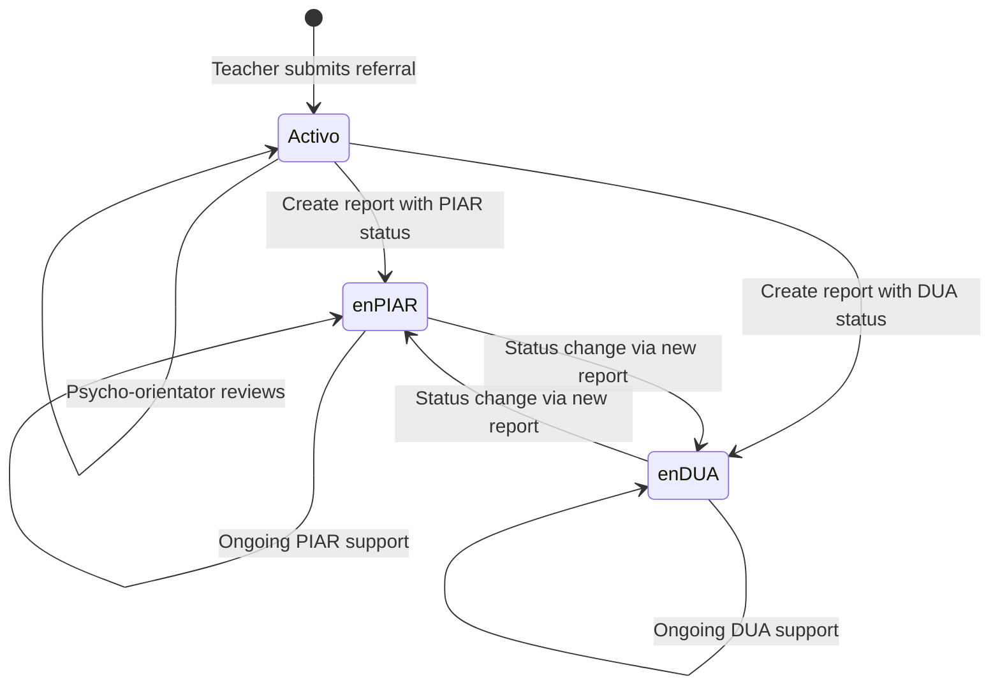

<Info>
The **Psycho-Orientator (Psicoorientador)** role manages student referrals, creates psychological reports, tracks student histories, and oversees PIAR (Individualized Adjustment Plan) and DUA (Universal Design for Learning) processes.
</Info>

## Overview

Psycho-orientators are responsible for evaluating referred students, creating detailed psychological reports, managing student interventions, and maintaining comprehensive case histories. They work closely with teachers and coordinators to support student well-being and academic success.

### Role Implementation

The psycho-orientator role is protected by `RolePsicoorientadorMiddleware`:

```php
public function handle(Request $request, Closure $next, ...$roles)
{
    if (!Auth::check() || !Auth::user()->hasRole('psicoorientador')) {
        abort(403, 'No tienes permiso para acceder a esta página.');
    }
    return $next($request);
}
```

*Source: `app/Http/Middleware/RolePsicoorientadorMiddleware.php:13-20`*

## Key Responsibilities

<CardGroup cols={2}>
  <Card title="Process Referrals" icon="inbox">
    Review and evaluate teacher-submitted student referrals
  </Card>
  <Card title="Psychological Reports" icon="file-medical">
    Create comprehensive assessment reports with recommendations
  </Card>
  <Card title="Student Management" icon="users">
    Organize students by status (Active, PIAR, DUA)
  </Card>
  <Card title="Case Histories" icon="clock-rotate-left">
    Maintain detailed records of all interventions and assessments
  </Card>
</CardGroup>

## Permissions & Access

### Psycho-Orientator-Specific Routes

```php
Route::middleware([RolePsicoorientadorMiddleware::class])->group(function () {
    // View referred students
    Route::get('/index/students/remitted/psico', 
        [PsicoController::class, 'index_student_remitted_psico'])
        ->name('index.student.remitted.psico');

    // Students by state
    Route::get('/psico/students/active', 
        [PsicoController::class, 'index_students_active_psico'])
        ->name('psico.students.active');
    Route::get('/psico/students/piar', 
        [PsicoController::class, 'index_students_piar_psico'])
        ->name('psico.students.piar');
    Route::get('/psico/students/dua', 
        [PsicoController::class, 'index_students_dua_psico'])
        ->name('psico.students.dua');

    // Referral details and updates
    Route::get('/details/referral/{id}', 
        [PsicoController::class, 'detailsReferral'])
        ->name('details.referral');
    Route::put('/edit/details/referral/{id}', 
        [PsicoController::class, 'update_details_referral'])
        ->name('update.details.referral');

    // Psychological reports
    Route::get('/report/student/{id}', 
        [PsicoController::class, 'report_student'])
        ->name('report.student');
    Route::post('/store/report/student/{id}', 
        [PsicoController::class, 'store_report_student'])
        ->name('store.report.student');

    // Student history
    Route::get('/student/history/{id}', 
        [PsicoController::class, 'show_student_history'])
        ->name('show.student.history');
    Route::get('/history/details/referral/{id}', 
        [PsicoController::class, 'history_details_referral'])
        ->name('history.details.referral');
    Route::get('/history/details/report/{id}', 
        [PsicoController::class, 'history_details_report'])
        ->name('history.details.report');
    Route::put('/edit/history/details/referral/{id}', 
        [PsicoController::class, 'update_history_details_referral'])
        ->name('update.history.details.referral');
    Route::put('/edit/history/details/report/{id}', 
        [PsicoController::class, 'update_history_details_report'])
        ->name('update.history.details.report');

    // Accept student to PIAR
    Route::put('/accept/student', 
        [PsicoController::class, 'accept_student_to_piar'])
        ->name('accept.student.to.piar');
});
```

*Source: `routes/web.php:158-202`*

### Shared Routes (Psycho-Orientators & Teachers)

Psycho-orientators can also create referrals and edit student information:

```php
Route::middleware([RolePsicoorientadorAndDocenteMiddleware::class])->group(function () {
    Route::get('/create/referral', [CreateReferralController::class, 'create_referral'])
        ->name('create.referral');
    Route::post('/store/referral', [CreateReferralController::class, 'store_referral'])
        ->name('store.referral');
    Route::get('/edit/student/{id}', [CreateReferralController::class, 'edit_student'])
        ->name('edit.student');
    Route::put('/update/student/{id}', [CreateReferralController::class, 'update_student'])
        ->name('update.student');
});
```

*Source: `routes/web.php:137-150`*

## Core Features

### Viewing Referred Students

Psycho-orientators see students from their assigned degree levels who have been referred by teachers.

```php
public function index_student_remitted_psico(Request $request)
{
    $id_psico = Auth::id();
    
    // Get assigned degree levels
    $load_degree = Users_load_degree::where('id_user', $id_psico)
        ->pluck('id_degree')
        ->toArray();
    
    // Get students in 'activo' state from assigned degrees
    $query = Users_student::whereHas('states', function ($q) {
            $q->where('state', 'activo');
        })
        ->whereIn('id_degree', $load_degree);
    
    // Search functionality
    if ($request->filled('search')) {
        $search = $request->search;
        $query->where(function ($q) use ($search) {
            $q->where('name', 'LIKE', "%$search%")
              ->orWhere('last_name', 'LIKE', "%$search%")
              ->orWhere('number_documment', 'LIKE', "%$search%");
        });
    }
    
    $students = $query
        ->orderBy('name')
        ->orderBy('last_name')
        ->paginate(15);
}
```

*Source: `app/Http/Controllers/PsicoController.php:105-132`*

**Key Features:**
- **Degree-based filtering**: Only shows students from assigned grade levels
- **Active referrals**: Displays students in "activo" state (awaiting review)
- **Search**: Find students by name or document number
- **Pagination**: 15 students per page

### Organizing Students by Status

Psycho-orientators can view students grouped by their current intervention status.

#### All Active Students

View all students from assigned degrees, regardless of state:

```php
public function index_students_active_psico(Request $request)
{
    $id_psico = Auth::id();
    
    $load_degree = Users_load_degree::where('id_user', $id_psico)
        ->pluck('id_degree')
        ->toArray();
    
    $query = Users_student::whereIn('id_degree', $load_degree);
    
    // ... search functionality ...
    
    return view('psycho.listStudentsByState', [
        'students'   => $students,
        'stateLabel' => 'Activos',
        'route'      => route('psico.students.active'),
    ]);
}
```

*Source: `PsicoController.php:63-92`*

#### Students in PIAR

View students in Individualized Adjustment Plan process:

```php
public function index_students_piar_psico(Request $request)
{
    return $this->studentsByState($request, 'en PIAR', 'En PIAR', 'psico.students.piar');
}
```

*Source: `PsicoController.php:95-97`*

#### Students in DUA

View students receiving Universal Design for Learning support:

```php
public function index_students_dua_psico(Request $request)
{
    return $this->studentsByState($request, 'en DUA', 'En DUA', 'psico.students.dua');
}
```

*Source: `PsicoController.php:100-102`*

### Reviewing Referral Details

Psycho-orientators can view and edit complete referral information:

```php
public function detailsReferral(string $id)
{
    $groups  = Group::orderByRaw('CAST(`group` AS UNSIGNED)')->get();
    $degrees = Degree::orderByRaw('CAST(`degree` AS UNSIGNED)')->get();
    
    $info_student = Users_student::findOrFail($id);
    $info_referral = Referral::where('id_user_student', $id)
        ->latest()
        ->first();
    
    return view('psycho.showDetailsReferral', compact(
        'groups',
        'degrees',
        'info_student',
        'info_referral'
    ));
}
```

*Source: `PsicoController.php:139-154`*

**Update Referral Information:**

```php
public function update_details_referral(Request $request, string $id)
{
    $request->validate([
        'number_documment' => 'required|digits_between:1,20|unique:users_students,number_documment,' . $id,
        'name'             => 'required|string',
        'last_name'        => 'required|string',
        'degree'           => 'required|exists:degrees,id',
        'group'            => 'required|exists:groups,id',
        'age'              => 'required|integer|min:0',
        'reason_referral'  => 'required|string',
        'observation'      => 'required|string',
        'strategies'       => 'required|string',
    ]);
    
    $student  = Users_student::findOrFail($id);
    $referral = Referral::where('id_user_student', $id)->latest()->first();
    
    // Update student information
    $student->update([
        'number_documment' => $request->number_documment,
        'name'             => $request->name,
        'last_name'        => $request->last_name,
        'id_degree'        => $request->degree,
        'id_group'         => $request->group,
        'age'              => $request->age,
    ]);
    
    // Update referral details
    if ($referral) {
        $referral->update([
            'reason'      => $request->reason_referral,
            'observation' => $request->observation,
            'strategies'  => $request->strategies,
            'course'      => Degree::find($request->degree)->degree,
        ]);
    }
}
```

*Source: `PsicoController.php:157-192`*

### Creating Psychological Reports

This is a core psycho-orientator function - creating comprehensive assessment reports.

<Steps>
  <Step title="Access Report Form">
    Navigate to `/report/student/{id}` for the student:
    
    ```php
    public function report_student(string $id)
    {
        $groups  = Group::orderByRaw('CAST(`group` AS UNSIGNED)')->get();
        $degrees = Degree::orderByRaw('CAST(`degree` AS UNSIGNED)')->get();
        $states  = State::whereIn('state', ['activo', 'en PIAR', 'en DUA'])->get();
        
        $info_student = Users_student::findOrFail($id);
        
        return view('psycho.addReportStudent', compact(
            'groups', 'degrees', 'states', 'info_student'
        ));
    }
    ```
    
    *Source: `PsicoController.php:199-212`*
  </Step>

  <Step title="Complete Report Details">
    Enter comprehensive assessment information:
    
    **Student Information (Editable)**:
    - Document number
    - Name and age
    - Degree and group
    - New state (activo, en PIAR, en DUA)
    
    **Report Content**:
    - **Title**: Brief report identifier
    - **Reason for Inquiry**: Why the assessment was conducted
    - **Recommendations**: Intervention strategies and next steps
    - **Annex**: Optional PDF attachment (max 5MB)
    
    ```php
    $request->validate([
        'number_documment' => 'required|digits_between:1,20|unique:users_students,number_documment,' . $id,
        'name'             => 'required|string',
        'last_name'        => 'required|string',
        'degree'           => 'required|exists:degrees,id',
        'group'            => 'required|exists:groups,id',
        'age'              => 'required|integer',
        'state'            => 'required|exists:states,id',
        'title_report'     => 'required|string',
        'reason_inquiry'   => 'required|string',
        'recomendations'   => 'required|string',
        'annex_one'        => 'nullable|mimes:pdf|max:5120',
    ]);
    ```
    
    *Source: `PsicoController.php:217-229`*
  </Step>

  <Step title="File Upload Processing">
    If a PDF annex is attached, it's stored with organized naming:
    
    ```php
    if ($request->hasFile('annex_one')) {
        $file = $request->file('annex_one');
        $studentId = $id;
        
        $fileName = 'student_' . $studentId . '_' . now()->format('Ymd_His') . '.pdf';
        
        $annexPath = $file->storeAs(
            'annexes/student_' . $studentId,
            $fileName,
            'public'
        );
    }
    ```
    
    Files are stored in: `storage/app/public/annexes/student_{id}/student_{id}_{timestamp}.pdf`
    
    *Source: `PsicoController.php:254-268`*
  </Step>

  <Step title="Report Creation & Student Update">
    The system performs multiple database operations in a transaction:
    
    ```php
    DB::beginTransaction();
    
    try {
        // Update student information and state
        $student->update([
            'number_documment' => $request->number_documment,
            'name'             => $request->name,
            'last_name'        => $request->last_name,
            'id_degree'        => $request->degree,
            'id_group'         => $request->group,
            'age'              => $request->age,
            'id_state'         => $request->state, // Changes status (activo/PIAR/DUA)
        ]);
        
        // Get group and director information
        $group = Group::findOrFail($request->group);
        $director = Users_teacher::where('group_director', $request->group)->first();
        
        // Create psycho-orientation report
        Psychoorientation::create([
            'psychologist_writes'    => Auth::id(),
            'id_user_student'        => $id,
            'age_student'            => $request->age,
            'group_student'          => $group->group,
            'director_group_student' => $director
                ? $director->name . ' ' . $director->last_name
                : 'No asignado',
            'title_report'           => $request->title_report,
            'reason_inquiry'         => $request->reason_inquiry,
            'recomendations'         => $request->recomendations,
            'annex_one'              => $annexPath,
        ]);
        
        DB::commit();
    } catch (\Exception $e) {
        DB::rollBack();
        return back()->with('error', $e->getMessage());
    }
    ```
    
    *Source: `PsicoController.php:231-294`*
  </Step>
</Steps>

<Note>
**Important**: Creating a report can change the student's state. If you assign "en PIAR" or "en DUA" status, the student will be removed from the active referrals list and appear in the corresponding status list.
</Note>

### Managing Student Histories

Psycho-orientators can view complete case histories with all referrals and reports.

#### View Complete History

```php
public function show_student_history(string $id)
{
    $student = Users_student::findOrFail($id);
    
    $referrals = Referral::where('id_user_student', $id)
        ->orderBy('created_at', 'desc')
        ->paginate(10);
    
    $reports = Psychoorientation::where('id_user_student', $id)
        ->orderBy('created_at', 'desc')
        ->paginate(10);
    
    return view('psycho.studentHistory', compact(
        'student',
        'referrals',
        'reports'
    ));
}
```

*Source: `PsicoController.php:301-317`*

**Features:**
- **Chronological order**: Most recent records first
- **Separate pagination**: 10 referrals and 10 reports per page
- **Complete overview**: All interventions and assessments in one view

#### View Historical Referral Details

```php
public function history_details_referral(string $id)
{
    $referral = Referral::with('user_student')->findOrFail($id);
    $student = $referral->user_student;
    
    // Find associated report
    $report = Psychoorientation::where('id_user_student', $student->id)
                ->latest()
                ->first();
    
    return view('psycho.detailsHistory.referral', compact('referral', 'student', 'report'));
}
```

*Source: `PsicoController.php:324-335`*

#### Edit Historical Referral

```php
public function update_history_details_referral(Request $request, string $id)
{
    $request->validate([
        'reason'      => 'required|string',
        'observation' => 'required|string',
        'strategies'  => 'required|string',
    ]);
    
    $referral = Referral::findOrFail($id);
    
    $referral->update([
        'reason'      => $request->reason,
        'observation' => $request->observation,
        'strategies'  => $request->strategies,
    ]);
}
```

*Source: `PsicoController.php:338-354`*

#### View Historical Report Details

```php
public function history_details_report(string $id)
{
    $report = Psychoorientation::findOrFail($id);
    $student = $report->user_student;
    
    return view('psycho.detailsHistory.report', compact('report', 'student'));
}
```

*Source: `PsicoController.php:362-367`*

#### Edit Historical Report

```php
public function update_history_details_report(Request $request, string $id)
{
    $request->validate([
        'title_report'   => 'required|string',
        'reason_inquiry' => 'required|string',
        'recomendations' => 'required|string',
        'annex_one'      => 'nullable|mimes:pdf|max:5120',
    ]);
    
    $report = Psychoorientation::findOrFail($id);
    
    $report->title_report   = $request->title_report;
    $report->reason_inquiry = $request->reason_inquiry;
    $report->recomendations = $request->recomendations;
    
    // Handle file replacement
    if ($request->hasFile('annex_one')) {
        // Delete old file
        if ($report->annex_one && Storage::disk('public')->exists($report->annex_one)) {
            Storage::disk('public')->delete($report->annex_one);
        }
        
        // Store new file
        $file = $request->file('annex_one');
        $fileName = 'student_' . $report->id_user_student . '_' . now()->format('Ymd_His') . '.pdf';
        $annexPath = $file->storeAs(
            'annexes/student_' . $report->id_user_student,
            $fileName,
            'public'
        );
        $report->annex_one = $annexPath;
    }
    
    $report->save();
}
```

*Source: `PsicoController.php:370-409`*

## Typical Workflows

### Processing a New Referral

<Steps>
  <Step title="Receive Notification">
    Receive email notification when a teacher submits a referral for a student in your assigned degrees
  </Step>

  <Step title="Review Referral List">
    Navigate to `/index/students/remitted/psico` to see all active referrals
  </Step>

  <Step title="Examine Details">
    Click on a student to view complete referral details:
    - Student information
    - Reason for referral
    - Teacher observations
    - Strategies already attempted
  </Step>

  <Step title="Conduct Assessment">
    Perform psychological evaluation (offline process)
  </Step>

  <Step title="Create Report">
    Navigate to `/report/student/{id}` and document:
    - Assessment findings
    - Recommendations
    - Student status change (if moving to PIAR or DUA)
    - Attach supporting documents if needed
  </Step>

  <Step title="Ongoing Support">
    Monitor student in appropriate status list (PIAR/DUA) and maintain case history
  </Step>
</Steps>

### Managing PIAR Students

<Steps>
  <Step title="Access PIAR List">
    Navigate to `/psico/students/piar` to view all students in PIAR process from your assigned degrees
  </Step>

  <Step title="Review Student History">
    Click on student to view complete case history with all referrals and reports
  </Step>

  <Step title="Create Progress Reports">
    Add new reports documenting progress and updating recommendations
  </Step>

  <Step title="Coordinate with Teachers">
    Teachers can add meeting minutes; review these for collaboration
  </Step>

  <Step title="Maintain Records">
    Edit historical reports as needed to keep information current
  </Step>
</Steps>

### Updating Historical Records

<Steps>
  <Step title="Access Student History">
    Navigate to `/student/history/{id}` for the student
  </Step>

  <Step title="Select Record">
    Click on specific referral or report to view details
  </Step>

  <Step title="Edit as Needed">
    Update information, add clarifications, or replace attachments
  </Step>

  <Step title="Save Changes">
    Changes are immediately reflected in the student's complete history
  </Step>
</Steps>

## Student Status Management



**Status Changes:**
- Status is updated when creating a psychological report
- Students move between status lists based on current state
- History retains all previous states and reports

## Data Organization

### Degree-Based Access Control

Psycho-orientators only see students from their assigned degrees:

```php
$id_psico = Auth::id();

$load_degree = Users_load_degree::where('id_user', $id_psico)
    ->pluck('id_degree')
    ->toArray();

$query = Users_student::whereIn('id_degree', $load_degree);
```

This ensures:
- Manageable caseloads
- Clear responsibility boundaries
- Privacy and organization

*Pattern used throughout: PsicoController.php*

### File Storage Structure

PDF annexes are organized by student:

```
storage/app/public/annexes/
├── student_1/
│   ├── student_1_20260306_143022.pdf
│   └── student_1_20260307_091514.pdf
├── student_2/
│   └── student_2_20260306_152130.pdf
└── student_3/
    └── student_3_20260305_104521.pdf
```

File naming: `student_{id}_{YYYYMMDD_HHmmss}.pdf`

*Implementation: PsicoController.php:254-268*

## Best Practices

<Note>
1. **Review referrals promptly**: Teachers and students await your assessment
2. **Document thoroughly**: Comprehensive reports support better interventions
3. **Use status changes strategically**: Moving students to PIAR/DUA should be based on clear criteria
4. **Maintain complete histories**: Update records as new information becomes available
5. **Attach supporting documents**: Use the annex feature for assessments, consent forms, etc.
6. **Coordinate with teachers**: Review meeting minutes from teachers working with PIAR/DUA students
7. **Use search features**: Quickly find students across large caseloads
8. **Organize by status**: Use the status-specific lists (active/PIAR/DUA) to prioritize work
</Note>

## Common Validations

<Warning>
**PDF Annex Requirements**

File uploads must meet these criteria:
- **Format**: PDF only (`.pdf`)
- **Size**: Maximum 5MB (5120 KB)
- **Storage**: Stored in `public` disk under `annexes/student_{id}/`

```php
'annex_one' => 'nullable|mimes:pdf|max:5120'
```

*Source: PsicoController.php:228*
</Warning>

<Warning>
**State Validation**

When creating reports, only specific states are allowed:

```php
$states = State::whereIn('state', ['activo', 'en PIAR', 'en DUA'])->get();
```

This prevents assigning invalid states.

*Source: PsicoController.php:203*
</Warning>

## Database Transactions

Report creation uses transactions to ensure data integrity:

```php
DB::beginTransaction();

try {
    // Update student
    $student->update([...]);
    
    // Create report
    Psychoorientation::create([...]);
    
    DB::commit();
} catch (\Exception $e) {
    DB::rollBack();
    return back()->with('error', $e->getMessage());
}
```

If any step fails, all changes are rolled back to maintain consistency.

*Source: PsicoController.php:231-294*

## Related Documentation

<CardGroup cols={2}>
  <Card title="Teacher Role" icon="chalkboard-user" href="/roles/teacher">
    Learn how teachers submit referrals
  </Card>
  <Card title="Coordinator Role" icon="user-tie" href="/roles/coordinator">
    Understand degree assignments and user management
  </Card>
</CardGroup>