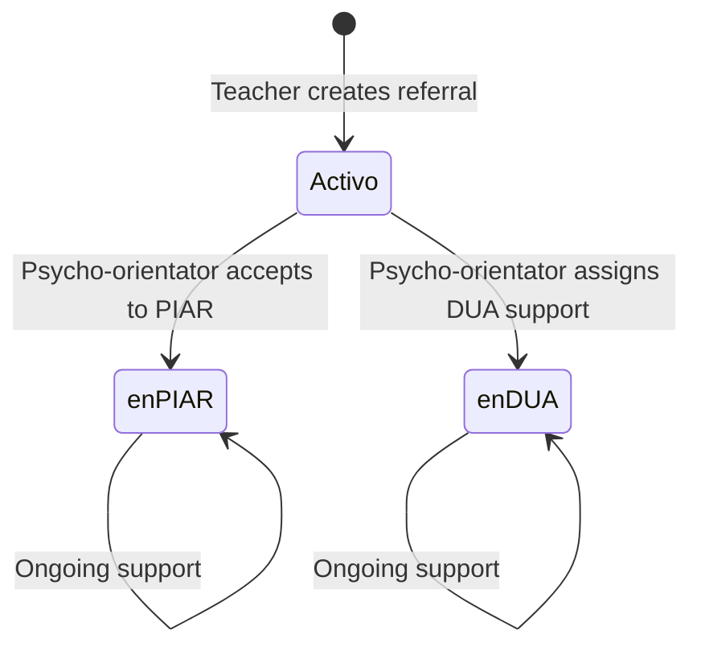

<Info>
The **Teacher (Docente)** role enables educators to submit student referrals to psycho-orientators, track referred students, and manage meeting minutes for students in PIAR or DUA processes.
</Info>

## Overview

Teachers are the primary point of contact for identifying students who need psychological support. They can create referrals, monitor student progress, and collaborate with psycho-orientators on intervention plans.

### Role Implementation

The teacher role is protected by `RoleDocenteMiddleware`:

```php
public function handle(Request $request, Closure $next, ...$roles)
{
    if (!Auth::check() || !Auth::user()->hasRole('docente')) {
        abort(403, 'No tienes permiso para acceder a esta página.');
    }
    return $next($request);
}
```

*Source: `app/Http/Middleware/RoleDocenteMiddleware.php:13-20`*

## Key Responsibilities

<CardGroup cols={2}>
  <Card title="Student Referrals" icon="file-medical">
    Submit students for psychological evaluation
  </Card>
  <Card title="Track Progress" icon="chart-line">
    Monitor referred students and their status
  </Card>
  <Card title="Meeting Minutes" icon="file-lines">
    Document sessions for students in PIAR/DUA
  </Card>
  <Card title="Student Information" icon="user-edit">
    Update student details and observations
  </Card>
</CardGroup>

## Permissions & Access

### Teacher-Specific Routes

Teachers have access to view their referred students and add meeting minutes:

```php
Route::middleware([RoleDocenteMiddleware::class])->group(function () {
    Route::get('/index/students/remitted', 
        [CreateReferralController::class, 'index_student_remitted'])
        ->name('index.student.remitted');

    Route::get('/addMinutes', [CreateReferralController::class, 'addMinutes'])
        ->name('addMinutes');
});
```

*Source: `routes/web.php:122-129`*

### Shared Routes (Teachers & Psycho-Orientators)

Both teachers and psycho-orientators can create referrals and edit students:

```php
Route::middleware([RolePsicoorientadorAndDocenteMiddleware::class])->group(function () {
    Route::get('/create/referral', 
        [CreateReferralController::class, 'create_referral'])
        ->name('create.referral');

    Route::post('/store/referral', 
        [CreateReferralController::class, 'store_referral'])
        ->name('store.referral');

    Route::get('/edit/student/{id}', 
        [CreateReferralController::class, 'edit_student'])
        ->name('edit.student');

    Route::put('/update/student/{id}', 
        [CreateReferralController::class, 'update_student'])
        ->name('update.student');
});
```

*Source: `routes/web.php:137-150`*

## Core Features

### Creating Student Referrals

Teachers can submit students for psychological evaluation through a comprehensive referral form.

<Steps>
  <Step title="Access Referral Form">
    Navigate to `/create/referral` to begin the referral process
    
    ```php
    public function create_referral()
    {
        $groups = Group::orderByRaw('CAST(`group` AS UNSIGNED), `group`')->get();
        $degrees = Degree::orderByRaw('CAST(`degree` AS UNSIGNED), `degree`')->get();
        return view('teacher.studentReferral', compact('groups', 'degrees'));
    }
    ```
    
    *Source: `app/Http/Controllers/CreateReferralController.php:22-28`*
  </Step>

  <Step title="Complete Student Information">
    Enter required student details:
    - **Document Number**: Unique student identifier (1-20 digits)
    - **Full Name**: Student's first and last name
    - **Degree & Group**: Academic level and class
    - **Age**: Optional, but recommended
    
    ```php
    $request->validate([
        'number_documment' => 'required|digits_between:1,20',
        'name' => 'required',
        'last_name' => 'required',
        'degree' => 'required',
        'group' => 'required',
        'age' => 'nullable|integer|min:0',
    ]);
    ```
    
    *Source: `CreateReferralController.php:37-42`*
  </Step>

  <Step title="Document Referral Reasons">
    Provide detailed information about why the student is being referred:
    
    - **Reason for Referral**: Primary concern or behavior
    - **Observations**: Specific incidents or patterns observed
    - **Strategies Implemented**: Interventions already attempted in the classroom
    
    ```php
    $request->validate([
        'reason_referral' => 'required|string',
        'observation' => 'required|string',
        'strategies' => 'required|string',
    ]);
    ```
    
    *Source: `CreateReferralController.php:44-46`*
  </Step>

  <Step title="System Validation">
    The system performs several checks:
    
    **Check 1: Psycho-Orientator Assignment**
    ```php
    $degreeLoad = Users_load_degree::where('id_degree', $request->input('degree'))
        ->first();
    
    if (!$degreeLoad) {
        return redirect()->back()->with('error', 
            'No se encontró un psicoorientador asignado para el grado seleccionado...');
    }
    ```
    
    **Check 2: Student Status**
    ```php
    $exist_student = Users_student::where('number_documment', $input_number_documment)
        ->first();
    
    if ($exist_student) {
        if ($state_info->state === 'activo') {
            return redirect()->back()->with('info',
                'El estudiante ya fue remitido y está en revisión por el psicoorientador.');
        } elseif ($state_info->state === 'en PIAR') {
            return redirect()->back()->with('info',
                'El estudiante ya está en proceso PIAR.');
        }
    }
    ```
    
    *Source: `CreateReferralController.php:52-87`*
  </Step>

  <Step title="Automatic Processing">
    Upon successful submission:
    
    1. **Student Record Created**:
    ```php
    $user = new Users_student();
    $user->number_documment = $request->number_documment;
    $user->name = $request->name;
    $user->last_name = $request->last_name;
    $user->age = $request->age;
    $user->id_degree = $request->degree;
    $user->id_group = $request->group;
    $user->sent_by = $id_teacher; // Current teacher ID
    $user->id_state = $state->id;  // 'activo' state
    $user->assignRole('estudiante');
    $user->save();
    ```
    
    2. **Referral Record Created**:
    ```php
    $referral = new Referral();
    $referral->id_user_student = $user->id;
    $referral->id_user_teacher = $id_teacher;
    $referral->reason = $request->reason_referral;
    $referral->observation = $request->observation;
    $referral->strategies = $request->strategies;
    $referral->course = $degreeName;
    $referral->save();
    ```
    
    3. **Email Notification Sent**:
    ```php
    Mail::to($psico_date->email)->queue(new CreatedReferralMail($user, $referral));
    ```
    
    *Source: `CreateReferralController.php:93-117`*
  </Step>
</Steps>

### Viewing Referred Students

Teachers can monitor all students they have referred who are currently in "activo" status.

```php
public function index_student_remitted(Request $request)
{
    $id_teacher = Auth::id();
    
    $query = Users_student::whereHas('states', function ($q) {
        $q->whereIn('state', ['activo']);
    })->where('sent_by', $id_teacher);
    
    // Search functionality
    if ($request->filled('search')) {
        $searchTerm = $request->input('search');
        $query->where(function ($q) use ($searchTerm) {
            $q->where('name', 'LIKE', '%' . $searchTerm . '%')
                ->orWhere('last_name', 'LIKE', '%' . $searchTerm . '%')
                ->orWhere('number_documment', 'LIKE', '%' . $searchTerm . '%')
                ->orWhereRaw("CONCAT(name, ' ', last_name) LIKE ?", ['%' . $searchTerm . '%']);
        });
    }
    
    $students = $query->with('latestReferral', 'group', 'degree')
        ->orderBy('name', 'asc')
        ->orderBy('last_name', 'asc')
        ->paginate(15);
}
```

*Source: `app/Http/Controllers/CreateReferralController.php:130-154`*

**Features:**
- **Filtered View**: Only shows students referred by the logged-in teacher
- **Status Filter**: Displays only active referrals (under psycho-orientator review)
- **Search**: Find students by name or document number
- **Pagination**: 15 students per page
- **Relationships**: Includes latest referral details, group, and degree information

### Editing Student Information

Teachers can update student details if needed:

<CodeGroup>
```php View Edit Form
Route::get('/edit/student/{id}', [CreateReferralController::class, 'edit_student'])
    ->name('edit.student');

public function edit_student(string $id)
{
    $student = Users_student::find($id);
    $groups = Group::orderByRaw('CAST(`group` AS UNSIGNED), `group`')->get();
    $degrees = Degree::orderByRaw('CAST(`degree` AS UNSIGNED), `degree`')->get();
    
    return view('teacher.studentEdit', compact('student', 'degrees', 'groups'));
}
```

```php Update Student
Route::put('/update/student/{id}', [CreateReferralController::class, 'update_student'])
    ->name('update.student');

public function update_student(Request $request, string $id)
{
    $request->validate([
        'number_documment' => 'required|digits_between:1,20|unique:users_students,number_documment,' . $id,
        'name' => 'required|string',
        'last_name' => 'required|string',
        'degree' => 'required',
        'group' => 'required',
        'age' => 'nullable|integer|min:0',
    ]);
    
    $student = Users_student::find($id);
    $nuevos_datos = [
        'number_documment' => $request->number_documment,
        'name' => $request->name,
        'last_name' => $request->last_name,
        'id_degree' => $request->degree,
        'id_group' => $request->group,
        'age' => $request->age,
    ];
    
    // Only update if changes detected
    if ($huboCambios) {
        $student->update($nuevos_datos);
        return redirect()->back()->with('success', 'Usuario editado correctamente.');
    }
}
```
</CodeGroup>

*Source: `CreateReferralController.php:161-218`*

### Adding Meeting Minutes

Teachers can document sessions with students who are in PIAR or DUA processes.

```php
public function addMinutes(Request $request)
{
    $id_teacher = Auth::id();
    
    // Get all groups this teacher supervises
    $id_load_groups = Users_load_group::where('id_user_teacher', $id_teacher)
        ->pluck('id_group');
    
    // Get students in PIAR or DUA from those groups
    $query = Users_student::whereHas('states', function ($q) {
        $q->whereIn('state', ['en PIAR', 'en DUA']);
    })->whereIn('id_group', $id_load_groups);
    
    // Search functionality
    if ($request->filled('search')) {
        $searchTerm = $request->input('search');
        $query->where(function ($q) use ($searchTerm) {
            $q->where('name', 'LIKE', '%' . $searchTerm . '%')
                ->orWhere('last_name', 'LIKE', '%' . $searchTerm . '%')
                ->orWhere('number_documment', 'LIKE', '%' . $searchTerm . '%')
                ->orWhereRaw("CONCAT(name, ' ', last_name) LIKE ?", ['%' . $searchTerm . '%']);
        });
    }
    
    $students = $query->orderBy('name', 'asc')
        ->orderBy('last_name', 'asc')
        ->paginate(15);
}
```

*Source: `app/Http/Controllers/CreateReferralController.php:222-248`*

**Key Points:**
- Only shows students in **PIAR** or **DUA** states
- Limited to groups the teacher supervises (based on `users_load_groups`)
- Searchable by student name or document
- Paginated display

## Typical Workflows

### Referring a Student for Evaluation

<Steps>
  <Step title="Identify Need">
    Notice concerning behavior, academic struggles, or emotional difficulties in a student
  </Step>

  <Step title="Implement Initial Strategies">
    Try classroom-level interventions and document their effectiveness
  </Step>

  <Step title="Create Referral">
    Navigate to `/create/referral` and complete the form with:
    - Student identification
    - Specific reasons for concern
    - Observations and patterns
    - Strategies already attempted
  </Step>

  <Step title="System Processing">
    The system automatically:
    - Creates student record (if new)
    - Assigns to appropriate psycho-orientator based on degree
    - Sends email notification to psycho-orientator
    - Sets student status to "activo" (under review)
  </Step>

  <Step title="Monitor Progress">
    Check `/index/students/remitted` to view referred students and their status
  </Step>
</Steps>

### Collaborating on PIAR/DUA Students

<Steps>
  <Step title="Access Minutes Interface">
    Go to `/addMinutes` to view students in intervention processes
  </Step>

  <Step title="Select Student">
    Choose from students in your groups who are in PIAR or DUA status
  </Step>

  <Step title="Document Session">
    Record meeting details, progress, and next steps
  </Step>

  <Step title="Ongoing Collaboration">
    Continue to coordinate with psycho-orientator on student support plan
  </Step>
</Steps>

## Student State Flow

Understanding how student states change helps teachers track referral progress:



**States:**
- **activo**: Under psycho-orientator review (teacher can view in referral list)
- **en PIAR**: Student in individualized adjustment plan (teacher can add minutes)
- **en DUA**: Student receiving universal design support (teacher can add minutes)

## Data Validation

<Warning>
**Psycho-Orientator Must Be Assigned**

Referrals require that the student's degree has an assigned psycho-orientator:

```php
$degreeLoad = Users_load_degree::where('id_degree', $request->input('degree'))->first();

if (!$degreeLoad) {
    return redirect()->back()->with('error', 
        'No se encontró un psicoorientador asignado para el grado seleccionado, '
        'comunicate con cordinación académica para que asigne a un psicoorientador.');
}
```

If no psycho-orientator is assigned, contact the coordinator to configure degree assignments.

*Source: CreateReferralController.php:52-56*
</Warning>

<Warning>
**Duplicate Referrals Prevented**

The system prevents duplicate referrals for students already in the system:

```php
if ($exist_student) {
    if ($state_info->state === 'activo') {
        return redirect()->back()->with('info',
            'El estudiante ya fue remitido y está en revisión por el psicoorientador.');
    } elseif ($state_info->state === 'en PIAR') {
        return redirect()->back()->with('info',
            'El estudiante ya está en proceso PIAR.');
    }
}
```

*Source: CreateReferralController.php:63-76*
</Warning>

## Best Practices

<Note>
1. **Document thoroughly**: Provide detailed observations and strategies in referrals to help psycho-orientators understand the full context
2. **Attempt interventions first**: Try classroom-level strategies before referring
3. **Use search features**: The student lists support searching to quickly find specific students
4. **Keep information current**: Update student details if circumstances change
5. **Coordinate with psycho-orientators**: Use the minutes feature to maintain ongoing communication about PIAR/DUA students
6. **Check degree assignments**: Verify psycho-orientator is assigned to the degree before referring
</Note>

## Common Issues & Solutions

<AccordionGroup>
  <Accordion title="Error: No psycho-orientator assigned to grade">
    **Problem**: When creating a referral, you receive an error that no psycho-orientator is assigned.
    
    **Solution**: Contact the coordinator to assign a psycho-orientator to the student's degree level through the user management interface.
  </Accordion>

  <Accordion title="Student already referred message">
    **Problem**: System shows a message that the student is already under review.
    
    **Solution**: Check the referred students list (`/index/students/remitted`) to see the current status. If the student is already in PIAR or DUA, use the minutes feature instead of creating a new referral.
  </Accordion>

  <Accordion title="Can't find student in minutes list">
    **Problem**: A student in PIAR/DUA doesn't appear in the meeting minutes interface.
    
    **Solution**: The minutes list only shows students from groups you supervise (based on `users_load_groups` configuration). Verify the student is in one of your assigned groups.
  </Accordion>
</AccordionGroup>

## Related Documentation

<CardGroup cols={2}>
  <Card title="Psycho-Orientator Role" icon="user-doctor" href="/roles/psycho-orientator">
    Learn how psycho-orientators process referrals
  </Card>
  <Card title="Coordinator Role" icon="user-tie" href="/roles/coordinator">
    Understand coordinator setup and configuration
  </Card>
</CardGroup>